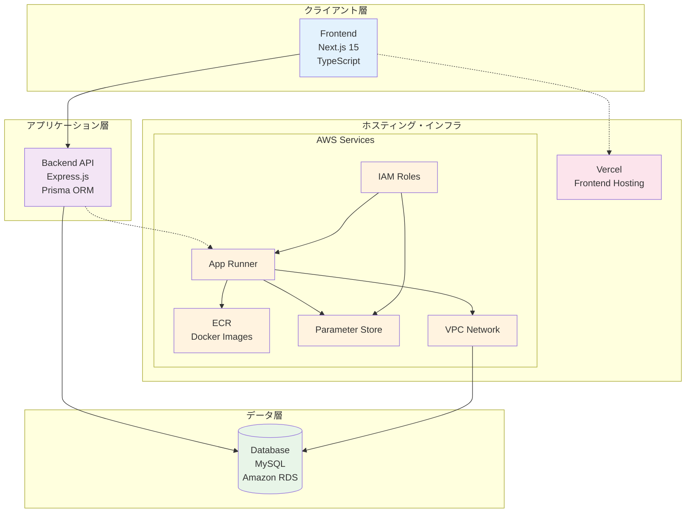

# Simple Budget - シンプル家計簿アプリ

## 概要

Simple Budgetは、個人の収支管理を効率的に行うためのWebアプリケーションです。直感的なUI/UXで日々の収支を記録し、支出分析や収支推移を可視化することができます。

## アーキテクチャ

### システム構成図


## 技術スタック

### フロントエンド
- **Next.js 15** - React フレームワーク（App Router使用）
- **TypeScript** - 型安全な開発
- **Tailwind CSS** - スタイリング
- **React Hook Form** - フォーム管理

### バックエンド
- **Express.js** - Node.js Webフレームワーク
- **TypeScript** - 型安全なサーバーサイド開発
- **Prisma** - データベースORM
- **JWT** - 認証・セッション管理
- **bcrypt** - パスワードハッシュ化

### データベース
- **MySQL** - リレーショナルデータベース
- **Amazon RDS** - マネージドデータベースサービス

### AWS インフラストラクチャ
- **Amazon RDS (MySQL)** - データベースホスティング
- **AWS App Runner** - バックエンドAPIのコンテナ実行
- **Amazon ECR** - Dockerイメージ保存
- **Parameter Store** - 環境変数とシークレット管理
- **IAM** - アクセス権限管理
- **Amazon VPC** - 仮想ネットワーク
- **Security Groups** - ネットワークセキュリティ
- **VPC Connector** - App RunnerとVPCの接続

## データベース設計

### 主要テーブル

#### Users（ユーザー）
- ユーザーアカウント情報
- 認証情報（メール、パスワード）
- プロフィール情報

#### Transactions（取引）
- 収入・支出の記録
- 金額、日付、説明
- カテゴリとの関連付け

#### Categories（カテゴリ）
- 収支のカテゴリ分類
- ユーザー固有のカスタムカテゴリ
- 収入・支出タイプの区別

#### Sessions（セッション）
- ユーザー認証セッション管理
- JWT トークン管理
- デバイス・セキュリティ情報

### ER図概要
```
Users ──┬── Transactions ── Categories
        │
        └── Sessions
```

## 主要機能

### 認証・ユーザー管理
- [ ] ユーザー登録・ログイン
- [ ] JWT認証
- [ ] セッション管理
- [ ] パスワードリセット

### 取引管理
- [ ] 収入・支出の登録
- [ ] 取引の編集・削除
- [ ] カテゴリ別分類

## 🔧 開発環境のセットアップ

### 前提条件
- Node.js 22.x 以上
- Docker & Docker Compose
- MySQL 8.0（ローカル開発用）

### セットアップ手順

1. **リポジトリのクローン**
   ```bash
   git clone <repository-url>
   cd simple-budget
   ```

2. **依存関係のインストール**
   ```bash
   # バックエンド
   cd backend
   npm install
   
   # フロントエンド
   cd ../frontend
   npm install
   ```

3. **環境変数の設定**
  構築中

4. **データベースのセットアップ**
   ```bash
   # Docker Compose でMySQL起動
   docker-compose up -d mysql
   
   # Prisma マイグレーション実行
   cd backend
   npx prisma migrate dev
   npx prisma generate
   ```

5. **開発サーバーの起動**
   ```bash
   # バックエンド（ポート8080）
   cd backend
   npm run dev
   
   # フロントエンド（ポート3000）
   cd frontend
   npm run dev
   ```

## デプロイメント

### AWS インフラストラクチャ
1. **データベース**: Amazon RDS (MySQL)
2. **バックエンド**: AWS App Runner + ECR
3. **フロントエンド**: Vercel
4. **環境変数**: AWS Parameter Store

### デプロイ手順
構築中

## テスト
構築中

## API ドキュメント

### 認証エンドポイント
- `POST /auth/register` - ユーザー登録
- `POST /auth/login` - ログイン
- `POST /auth/refresh` - トークンリフレッシュ
- `POST /auth/logout` - ログアウト

### 取引エンドポイント
- `GET /transactions` - 取引一覧取得
- `POST /transactions` - 新規取引作成
- `PUT /transactions/:id` - 取引更新
- `DELETE /transactions/:id` - 取引削除

### カテゴリエンドポイント
- `GET /categories` - カテゴリ一覧取得
- `POST /categories` - カテゴリ作成
- `PUT /categories/:id` - カテゴリ更新
- `DELETE /categories/:id` - カテゴリ削除

## セキュリティ

- **認証**: JWT + Refresh Token
- **パスワード**: bcrypt ハッシュ化
- **CORS**: 適切なオリジン制限
- **レート制限**: Express rate limiting
- **データ検証**: Joi/Zod バリデーション
- **SQL インジェクション対策**: Prisma ORM
